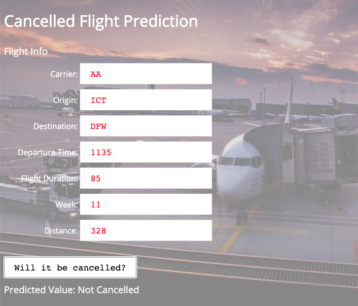

# Airline Delay Prediction
This project is a Cloudera Machine Learning ([CML](https://www.cloudera.com/products/machine-learning.html)) **Applied Machine Learning Prototype**. It has all the code and data needed to deploy an end-to-end machine learning project in a running CML instance.

This project was initially created for the *End-to-end ML at Scale workshop*. It creates and model and front-end application that can predict the likelihood of a flight being cancelled based on historic flight data. The original dataset comes from [Kaggle](https://www.kaggle.com/yuanyuwendymu/airline-delay-and-cancellation-data-2009-2018). By following the notebooks and scripts in this project, you will understand how to perform similar tasks on CML, as well as how to use the platform's major features to your advantage. These features include **model training**, **point-and-click model deployment**, and **ML application hosting**.

## Automated Build

There are two options for automatically building and deploying all project artifacts.

1. ***Launch as Applied Machine Learning Prototype (AMP) on CML*** - Select this AMP from the Prototype Catalog pane on Cloudera Machine Learning and configure the project to build all artifacts.
2. ***Use Automated Build Script in Project Repository*** - Create a new project in CML and select "Git" as this *Initial Setup* option. Enter this repo's URL to create a new project will all files loaded. Then, open a Python3 workbench session and run all lines in `10_build_project.py`.

## Manual Walkthrough

If you want go through each of the steps manually to build and understand how the project works, follow the steps below. There is a lot more detail and explanation/comments in each of the files/notebooks so its worth looking into those. Follow the steps below and you will end up with a running application. We will focus our attention on working within CML, using all it has to offer, while glossing over the details that are simply standard data science. We trust that you are familiar with typical data science workflows and do not need detailed explanations of the code. Notes that are *specific to CML* will be emphasized in **block quotes**.

### 0 - Bootstrap

There are a couple of steps needed at the start to configure the Project and Workspace settings so each step will run successfully. You **must** run the project bootstrap before running other steps.

Open the file `0_bootstrap.py` in a normal workbench python3 session. You only need a 1 CPU / 2 GB instance. Then **Run > Run All Lines**

### 1 - Convert Hive to External

### 2 - Data Analysis

### 3 - Data Processing

### 4 - Model Build

### 5 - Model Train

### 6 - Model Serve

### 7 - Application

### 8 - Model Simulation